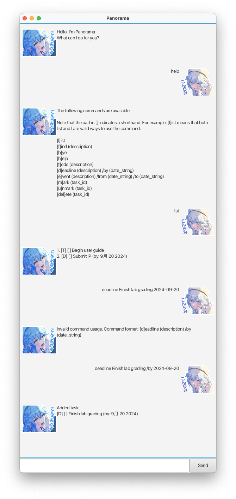

# Panorama User Guide

## Menu

- [Feature List](#feature-list)
- [Commands](#commands)
    - [Add Todo](#add-todo)
    - [Add Deadline](#add-deadline)
    - [Add Event](#add-event)
    - [List All Tasks](#list-all-tasks)
    - [Mark Task](#mark-task)
    - [Unmark Task](#unmark-task)
    - [Find Tasks](#find-tasks)
    - [Delete Task](#delete-task)
    - [Exit](#exit)

## Feature List

1. **Add Task** (todo, deadline, event)
    - Todo consists of only task description.
    - Deadline contains due date of the task.
    - Event specifies the start and end date of the task.
2. **Mark Task as Done/Not Done**
3. **Delete Task**
4. **Find Tasks by Keyword**
5. **Auto-save/load Tasks**

## Commands

Each command follows a specific format:

- `date_string` is a `YYYY-MM-DD`.
- `[t]odo` means that you can either use `t` or `todo`.
- `(description)` refers to compulsory params.

### Add Todo

Add a task that only contains a description using:

`[t]odo (description)`

**Example**: `todo Wash Clothes`

**Result**: Adds a task titled "Wash Clothes" to your list.

### Add Deadline

Add a task with a due date using:

`[d]eadline (description) /by (date_string)`

**Example**: `deadline iP Final Submission /by 2024-09-20`

**Result**: Adds a deadline task "iP Final Submission" due on 20 September 2024.

### Add Event

Add a task with a start and end date using:

**Example**: `event Waseda Seiransai /from 2024-09-21 /to 2024-09-22`

**Result**: Adds an event task "Waseda Seiransai" from 21 September 2024 to 22 September 2024.

### List All Tasks

List all current tasks using:

`[l]ist`

**Result**: Displays all tasks currently tracked by Panorama.

### Mark Task

Mark a task using:

`[m]ark (task_id)`

Note that `task_id` is the 1-indexed position of the task in the list. You can obtain the `task_id` by performing `list`.

**Example**: `mark 1`

**Result**: Marks the task with ID 1, i.e. the first task in the list.

One might typically use this to
- mark a task as completed, or
- mark a task as something you want to do today.

### Unmark Task

Unmark a task using:

`[u]nmark (task_id)`

Note that `task_id` is the 1-indexed position of the task in the list. You can obtain the `task_id` by performing `list`.

**Example**: `unmark 1`

**Result**: Unmarks the task with ID 1, i.e. the first task in the list.

### Delete Task

Delete a task using:

`[d]elete (task_id)`

Note that `task_id` is the 1-indexed position of the task in the list. You can obtain the `task_id` by performing `list`.

**Example**: `delete 1`

**Result**: Deletes the task with ID 1, i.e. the first task in the list.

### Find Tasks

Find tasks that match a certain keyword using:

`[f]ind (keyword)`

Note that:

- `keyword` is case-sensitive
- A task is a match when the `keyword` is one of the words in the task description.

**Example**: `find Meeting`

**Result**: Displays all tasks containing the keyword "Meeting".

### Exit

Exit the application using:

`[b]ye`

Note that Panorama has auto-save and auto-load, so you can safely run `bye` whenever you want to close the application.

**Result**: Closes the Panorama application.
